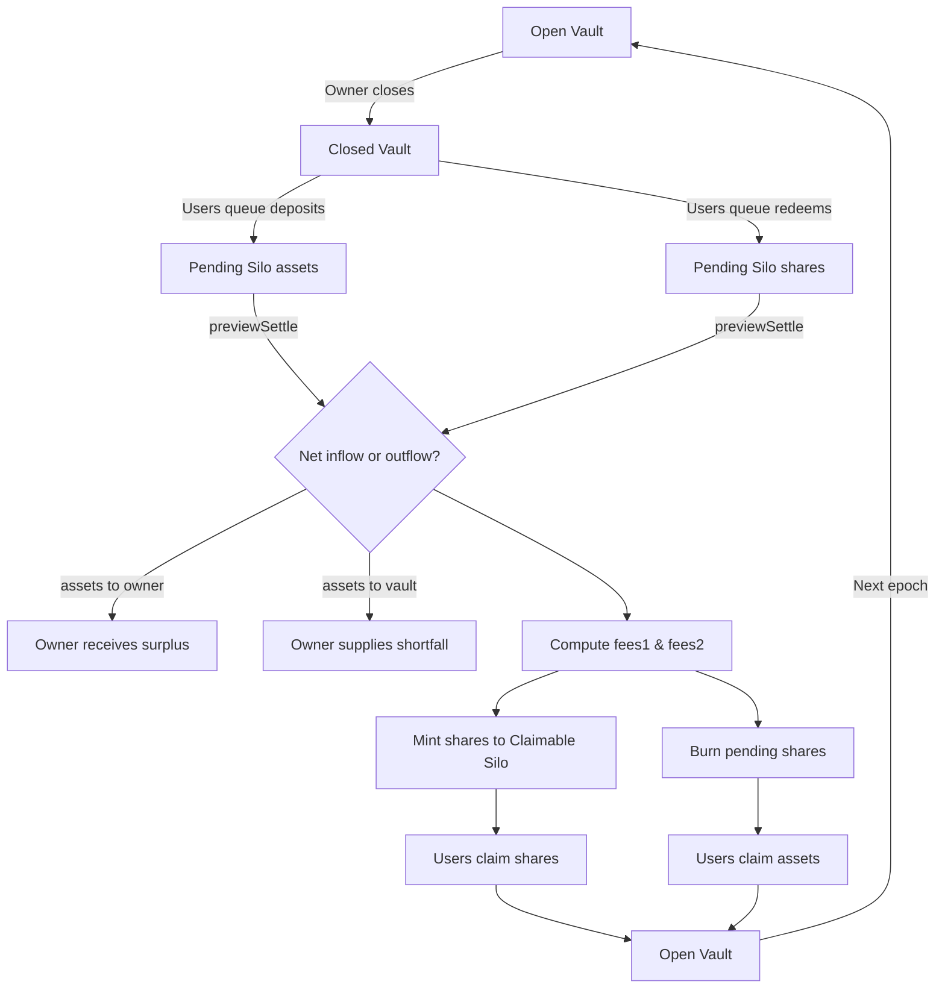

## Asynchronous vaults

**This repository implements the ERC-7540 standard, it should so be considered as a draft since the standard is still in review state.**

### What is this?

An ERC-7540-inspired asynchronous vault system built on top of an ERC-4626-like base. Users enqueue deposits and redemptions while the vault is closed; the manager then settles those requests per epoch, netting deposits vs withdrawals and applying fees. This enables time-batched execution and strategy coordination.

### General overview

- The vault has two states: open and closed. When open, users can deposit and withdraw. When closed, funds are taken away from the vault (farmed in strategies) and users can only request a deposit or request a redeem.
- Requests are processed when the owner calls `settle` or `open`. The vault changes epoch, processes requests by moving funds between the silos, and reopens (for `open`) or stays closed (for `settle`).
- Two helper contracts separate funds: `PendingSilo` and `ClaimableSilo`.
- Each vault is bootstrapped to avoid an inflation attack.
- `AsyncVault` inherits from the abstract `SyncVault` and implements asynchronous deposit and redeem flows.
- `VaultZapper` swaps tokenA into tokenB and deposits/requests-deposit in a vault in one transaction.

### High-level flow



### Contracts and roles

- **SyncVault**: Base 4626-like vault. Handles deposits, redemptions, conversions, and pause/permit.
- **AsyncVault**: Adds request queues, epoching, settlement math, fees and drawdown guard.
- **Silo**: Minimal holders used to separate pending and claimable balances.
- **VaultZapper**: Optional helper to swap then deposit/request-deposit in one transaction.
- **Owner/Manager**: Closes, settles and reopens epochs; sets fees and treasuries.

### Epoch lifecycle

1. Owner calls `close`:
   - Snapshots state and transfers funds to owner (strategy).
   - Users can only `requestDeposit`/`requestRedeem`.
2. Owner calls `previewSettle(newSavedBalance)`:
   - Simulates the netting of queued deposits and redemptions, fees, and snapshots.
   - Returns: assets to/from owner and detailed `SettleValues`.
3. Owner calls `settle(newSavedBalance)` or `open(assetReturned)`:
   - Finalizes accounting (mint/burn/move between silos, charge fees), updates snapshots, advances `epochId`.
   - `open` re-opens the vault after settlement.
4. Users call `claimDeposit`/`claimRedeem` to receive shares/assets from claimable silo.

### Request/claim functions

- `requestDeposit(assets, receiver, owner, data)`: Moves `assets` to pending silo and records the request.
- `requestRedeem(shares, receiver, owner, data)`: Moves `shares` to pending silo and records the request.
- `claimDeposit(receiver)`: Transfers minted shares from claimable silo to `receiver`.
- `claimRedeem(receiver)`: Transfers assets from claimable silo to `receiver`.

### Fees and safeguards

- Two fee schedules (`fees1`, `fees2`) apply on average balance over the epoch duration.
- A max drawdown guard rejects a settlement if new balance drops beyond configured bounds.
- Conversions (assets<->shares) use epoch snapshots and +1 denominators for stability near zero.

### Proxy pattern

The vaults use a beacon proxy pattern. In tests we deploy via OpenZeppelin upgrades tools. Run tests with `forge clean && forge test --ffi`. To run tests without the proxy pattern (implementation only), set `PROXY=false` in `.env`, remove `disableInitializers()` in constructors and run `forge test`.

### Zapper

The zapper uses 1inch router v4. Set `ONEINCH_API_KEY` in `.env` to run tests (you may be rate limited).

### previewSettle math (intuition)

We simulate deposits first, then redemptions, using the same math as `convertToShares`/`convertToAssets` with +1 guards:

```
sharesToMint = pendingDeposit * (totalSupply + 1) / (lastSavedBalance + 1)
assetsToWithdraw = pendingRedeem * (lastSavedBalance + pendingDeposit + 1)
                   / (totalSupply + sharesToMint + 1)
```

If `pendingDeposit > assetsToWithdraw`, `assetsToOwner = pendingDeposit - assetsToWithdraw`.
Else if `pendingDeposit < assetsToWithdraw`, `assetsToVault = assetsToWithdraw - pendingDeposit`.

We store snapshots for reuse in claim functions.

### Developer setup

- Copy `example.env` to `.env`. Provide RPC URLs and FFI flags where needed.
- Build and test:
  - `forge clean && forge build`
  - `forge test --ffi` (proxy + OZ upgrades path)
  - Or set `PROXY=false` in `.env` and run `forge test` on implementations only

### Security considerations

- Reentrancy protection (`nonReentrant`) on request/claim functions and zapper helpers.
- Receiver callbacks are invoked post state updates in internal helpers (CEI pattern).
- Silos pre-approve the vault to streamline flows without repeated approvals.

### Troubleshooting

- Compiler mismatch: ensure `foundry.toml` uses `solc = "0.8.30"` and pragmas use `^0.8.30`.
- Import not found in editor: add remappings in your editor config to resolve `lib/`.
- Slither false positives on reentrancy: use nonReentrant and optional suppression comments.

## USDC example: 15% APY, 12 epochs per year (share price intuition)

This example explains how a regular investor can expect returns when the vault uses USDC (6 decimals) and targets 15% APY with 12 epochs per year (roughly monthly).

### Key notions

- Price per share (PPS): PPS = totalAssets / totalSupply (conceptually; implementation uses precise snapshots with minor +1 guards).
- Epoch: The manager “closes” the vault, runs strategy, then “settles” and optionally “opens” the next epoch.
- Requests: During “closed,” deposits and redemptions become requests and are settled at epoch end at fair prices.

### From APY to per‑epoch growth

Annual yield r = 15%.

Per‑epoch gross factor (12 epochs):

\( g = (1 + 0.15)^{1/12} \approx 1.0117 \) → about +1.17% per epoch.

If there were no fees and no mid‑epoch flows, PPS after n epochs would be roughly:

\( \text{PPS}_n \approx \text{PPS}_0 \cdot g^n \).

In practice, deposits/redemptions are netted at settlement and fees are applied; PPS reflects the realized performance.

### What happens each epoch (investor view)

1) Manager closes the vault. You cannot instant‑deposit/redeem, but you can “request” to deposit or redeem.

2) At settlement, the vault simulates deposits first (mints shares at the pre‑settlement PPS), then simulates redemptions (pays assets at the post‑deposit PPS). It also applies any configured fees and checks for max drawdown.

3) After settlement:
- If you requested a deposit, you receive newly minted shares in the claimable silo and can claim them.
- If you requested a redemption, you receive assets in the claimable silo and can claim them.

Your returns are reflected in the PPS growth over epochs. If the strategy delivered ~1.17% in the epoch, the PPS (and thus the value of your existing shares) grows by roughly that amount, minus fees.

### Concrete monthly walkthrough (numbers rounded)

Assumptions:
- Underlying: USDC (6 decimals)
- Start of Epoch 0: totalSupply = 1,000,000 shares, totalAssets = 1,000,000 USDC → PPS ≈ 1.000000
- Target per‑epoch gross ≈ +1.17%
- Ignore fees for the illustration

End of Epoch 0 (settlement input): newSavedBalance ≈ 1,011,700 USDC

Settlement effects (simplified intuition):
- PPS increases to ≈ 1.011700 (1.17% higher) for the next epoch
- No mint/burn if no requests; just a PPS change via totalAssets grow

Depositor during the closed phase:
- You request to deposit 10,000 USDC in Epoch 0 (while closed)
- At settlement, your minted shares ≈ 10,000 / 1.000000 = 9,999.99… shares (precise math uses snapshots and small +1 guards)
- After settlement (Epoch 1), your shares can be claimed; they will now float at the new PPS (~1.011700)
- The market value of your 10,000 USDC deposit immediately reflects strategy performance into the next epoch via the PPS

Redeemer during the closed phase:
- You request to redeem 10,000 shares in Epoch 0
- At settlement, assets paid ≈ 10,000 × 1.011700 = 10,117 USDC (again, precise math uses snapshots and +1 guards)
- After settlement, you claim your 10,117 USDC

Note: When both deposits and redemptions exist in the same epoch, the vault nets them fairly in a deterministic order (simulate deposit, then simulate redemption) as implemented in `previewSettle`. Snapshots ensure each side is priced at consistent PPS values.

### Where this happens in code (plain English)

- The vault records pending deposits and redemptions in a `pendingSilo` while closed.
- `previewSettle` simulates:
  - Minted shares for deposits at the pre‑settlement PPS
  - Assets to withdraw for redemptions at the post‑deposit PPS
  - Fees (if any), and computes whether the owner should send funds to the vault or may receive surplus
- `settle` (or `open`) then executes those transfers and mints/burns for real, moving results into the `claimableSilo` for users to claim.
- PPS for the next epoch is implicitly updated by the new `totalAssets` and `totalSupply` after settlement.

### TL;DR for a regular USDC investor

- You can deposit or redeem instantly when the vault is open.
- When the vault is closed, you submit a request that will be executed at the end of the epoch.
- If the strategy achieves ~15% APY (≈1.17% per month), PPS tends to grow ≈1.17% each epoch (before fees). Your existing shares benefit from this growth.
- Requests you make during a closed epoch are priced fairly using snapshots at settlement time.

## Quickstart

### Install Foundry

```bash
curl -L https://foundry.paradigm.xyz | bash
foundryup
```

### Install dependencies

```bash
forge install
```

### Build and test

```bash
forge clean && forge build
forge test --ffi
```

### Environment (.env)

- Copy `example.env` to `.env` and fill values:
  - **FOUNDRY_ETH_RPC_URL**: RPC endpoint used by tests/scripts
  - **FOUNDRY_FFI=true**: Required for proxy/upgrades tests
  - **PROXY=true/false**: Toggle proxy pattern in tests
  - **ONEINCH_API_KEY**: For `VaultZapper` tests

## Repository structure

```
src/
  AsyncVault.sol         # ERC-7540-inspired async vault (epochs, requests, settlement)
  SyncVault.sol          # 4626-like base (deposits, redeems, conversions, pause/permit)
  LRTVault.sol           # Example/simple variant (linear 1:1 deposit/mint)
  VaultZapper.sol        # Helper to swap and deposit/request in one tx
  interfaces/            # Interfaces (ERC-7540, receiver hooks, ERC-165)
script/                  # Deployment/upgrade scripts
test/                    # Unit tests, utilities, constants
lib/                     # Vendored dependencies (openzeppelin, forge-std, etc.)
```

## State machine (text infographic)

```text
  ┌──────────────┐       close()         ┌────────────────┐
  │   OPENED     │  ───────────────────► │    CLOSED      │
  │ (users can   │                       │ (queue only:   │
  │  deposit/    │ ◄───────────────────  │  requestDeposit│
  │  withdraw)   │        open()         │  /requestRedeem)│
  └──────────────┘                       └────────────────┘
         ▲                                        │
         │                                        │ settle()/open()
         │                                        ▼
         │                                ┌───────────────────────┐
         │                                │  SETTLEMENT (epoch n) │
         │                                │  - previewSettle()    │
         │                                │  - apply fees         │
         │                                │  - mint/burn, move    │
         │                                │    between silos      │
         │                                └───────────────────────┘
```

## Request/claim flows (text infographic)

```text
requestDeposit(assets, receiver, owner, data)
  user ──assets──► PendingSilo
       └─ record request in epochs[epochId].depositRequestBalance[receiver]
       └─ optional receiver.onERC7540DepositReceived hook

requestRedeem(shares, receiver, owner, data)
  user ──shares──► PendingSilo (via _update/transfer)
       └─ record request in epochs[epochId].redeemRequestBalance[receiver]
       └─ optional receiver.onERC7540RedeemReceived hook

claimDeposit(receiver)
  ClaimableSilo ──shares──► receiver   (after settle/open)

claimRedeem(receiver)
  ClaimableSilo ──assets──► receiver   (after settle/open)
```

## Settlement math (intuition and stability) 

- Simulate deposit first (mint preview) then redeem (withdraw preview) using epoch snapshots.
- Use `+1` in numerators/denominators to avoid div-by-zero and limit rounding bias near zero.

```text
sharesToMint      = pendingDeposit * (totalSupply + 1) / (lastSavedBalance + 1)
assetsToWithdraw  = pendingRedeem   * (lastSavedBalance + pendingDeposit + 1)
                                     / (totalSupply + sharesToMint + 1)

if pendingDeposit > assetsToWithdraw:
   assetsToOwner = pendingDeposit - assetsToWithdraw
else if pendingDeposit < assetsToWithdraw:
   assetsToVault = assetsToWithdraw - pendingDeposit
expectedAssetFromOwner = fees1 + fees2 + assetsToVault
```

## API cheatsheet

- **User**
  - `requestDeposit(uint256 assets, address receiver, address owner, bytes data)`
  - `requestRedeem(uint256 shares, address receiver, address owner, bytes data)`
  - `claimDeposit(address receiver)` → shares
  - `claimRedeem(address receiver)` → assets
  - `previewClaimDeposit(address owner)` / `previewClaimRedeem(address owner)`

- **Manager**
  - `close()` → start epoch (lock vault, snapshot, move funds to owner)
  - `previewSettle(uint256 newSavedBalance)` → dry-run
  - `settle(uint256 newSavedBalance)` → finalize accounting (stay closed)
  - `open(uint256 assetReturned)` → finalize and re-open
  - `setTreasury{1,2}(address)` / `setFees{1,2}(uint16)`

## Security notes

- `nonReentrant` on entry-points that move value or can trigger callbacks.
- Receiver hooks are invoked after internal state updates (CEI).
- Drawdown guard rejects pathological settlements.

## Common pitfalls

- Using the wrong Solidity version: update pragmas to `^0.8.30` and `foundry.toml` to `0.8.30`.
- Editor import errors: configure remappings for `lib/` or use the VS Code Solidity settings.
- Zapper rate limits: 1inch API keys and public endpoints may throttle; consider local mocks.
